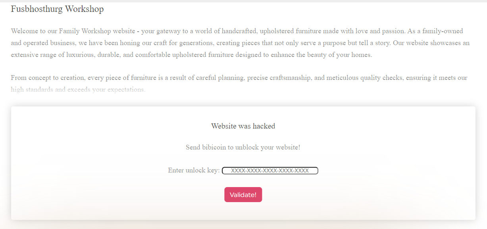

О нет! Наш сайт взломали и хотят целый бибикоин.

  

Посмотрим исходный код страницы, видим JS [скрипт](./Validate.js), который занимается валидацией ключа, который будем вводить.

  

Попросил GPT перевести полученный JS на человеческий (Java) и начал анализировать код и писать вокруг него кейген.

Как проходит валидация:
- Проверка формата введенного ключа. Должно быть 24 символа, из которых 4 тире.
- Тире убираются из ключа
- Проверяется контрольная сумма. В скрипте есть некая готовая функция расчета контрольной суммы. Скрипт проверяет, что если применить эту функцию к первым 16 символам ключа, то получим последние 4 символа ключа.
- Проверяется seed - первые 8 символов ключа должны быть валидными цифрами в шестнадцатеричном представлении.
- Проверяется subkey. Так же как и с контрольной суммой - есть функция, которая вычисляет некий subkey. Необходимо чтобы символы 9 и 10 были subkey для seed.
- 6 символов по центру - свободные.

После анализа этих условий прикидываем как делать кейген:
- Выбрал такой формат: SEEDSEED-SK-FFF-FFF-CSCS. Первые 8 символов - seed, затем subkey, затем 2 группы свободных символов по 3 символа и 4 символа на контрольную сумму.
- Случайно генерируем seed. Для того чтоб не ловить всяких переполнений - ограничил символы значениями до 8.
- На основе seed генерируем subkey.
- Циклами генерируем свободные символы. Для каждой полученной комбинации считаем контрольную сумму.
- Когда ключ получен целиком - отправляем его на проверку. Если проверка пройдена - выдаем ключ.

Запускаем наш [кейген](./Main.java) и быстро получаем результат

  

Остается проверить и найти флаг

  

