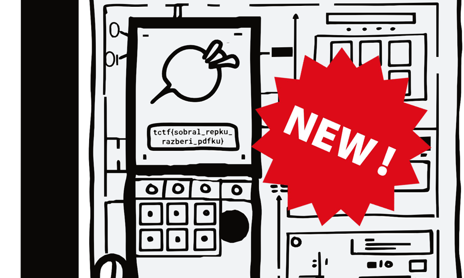

Листаем pdf-ку и видим начало флага tctf{ и наклейку на дальнейшем тексте.

  

Коллега, у которого был Adobe Acrobat с лицензией просто нажал редактирование и отодвинул наклейку.
Я просто экспортировал pdf в формат PowerPoint и отодвинул ее там.

  

