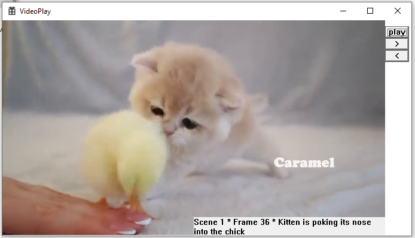
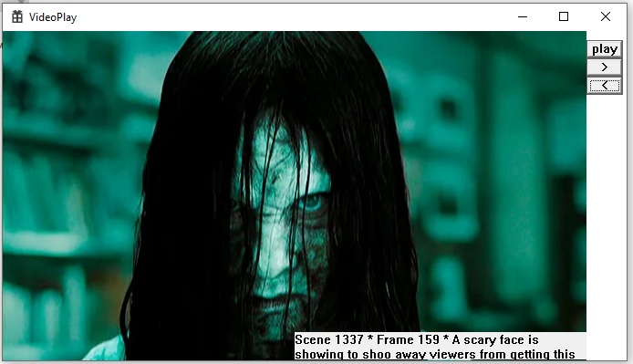
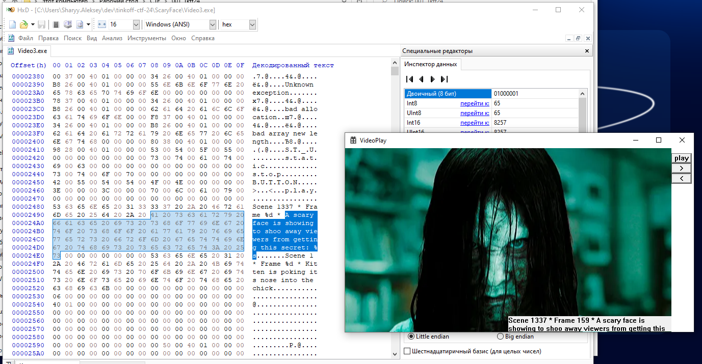
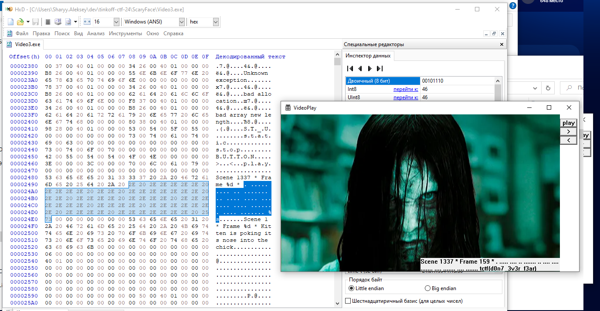

Открываем приложение и видим, что оно представляет собой видеоплеер с вшитым роликом

  

Интересующий нас кадр найти несложно, но флага не видать

  

Было потрачено много времени на экспорт картинки, ковыряние формата bmp на случай если что-то спрятано в самой картинке, на просмотр приложения через IDA, чтобы увидеть что лежит под этой картинкой в памяти.

Но все оказалось проще. Надо было посмотреть софтину обычным hex редактором. Делаем поиск по слову "scary" и видим искомую строку. В конце строки %s намечает на то что сюда приклеится тот самый секрет. (Формируется он динамически, поиск tctf по статике ничего не даст)

  

Итак, мы поняли что наша искомая строка просто не влазит в окошко для отображения. Мы не можем ее укоротить за счет удаления символов - если мы удалим какой-то байт через hex редактор, то у нас поедут все смещения и программа вероятней всего просто не запустится.

Но мы можем изменять значения байтов как хотим. Поэтому можно забить весь неинтересный нам текст какими-то символами, которые занимают меньше места при отображения. Например точками. И вот наш флаг. 

  

