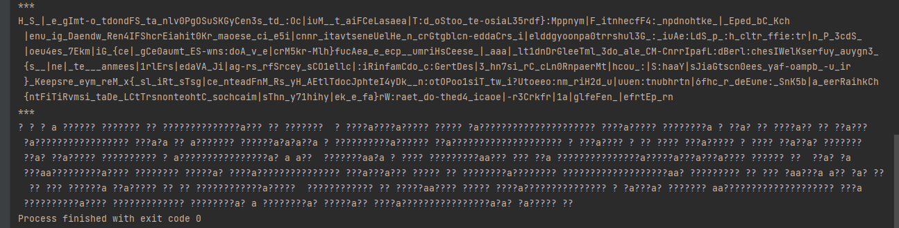

Что за вой на болотах? Это Шерлок потерял ключ от своей картотеки дел. Помогите восстановить и её, и честь Холмса, подобрав ключ и расшифровав картотеку.

Зашифрованная картотека: [case_database.txt.enc](./case_database.txt.enc)

Усовершенствованный классический метод шифрования, которым пользуется Холмс: [scheme_a403e00.pdf](./scheme_a403e00.pdf)
***

Накидал на Java программку, которая строила карту частоты используемых символов, чтобы как-то анализировать входной поток. Далее можно было задать соответствие символов - что на что менять в расшифрованном сообщении. Для символов без сопоставления ставится "?".

  

Долго крутил всякие разные варианты, нашел онлайн словарь который умеет подбирать слова по маске (например можно вбить туда ?aa???a и увидеть есть ли слова, которые соответствуют этой маске). Пытался отталкиваться от того что там точно есть фигурные скобки от ключа, но не получилось ничего вменяемого 